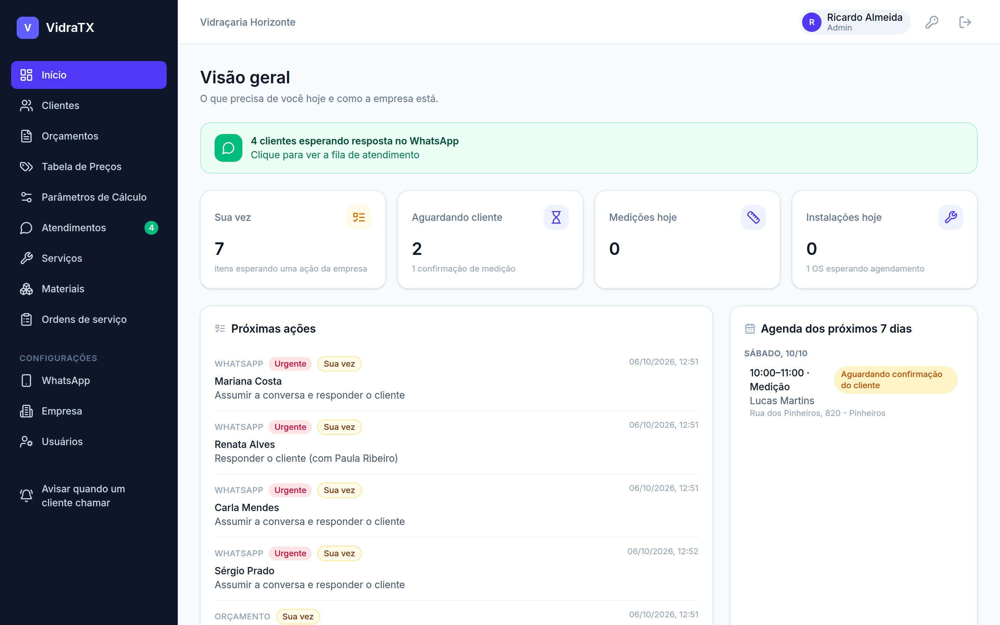
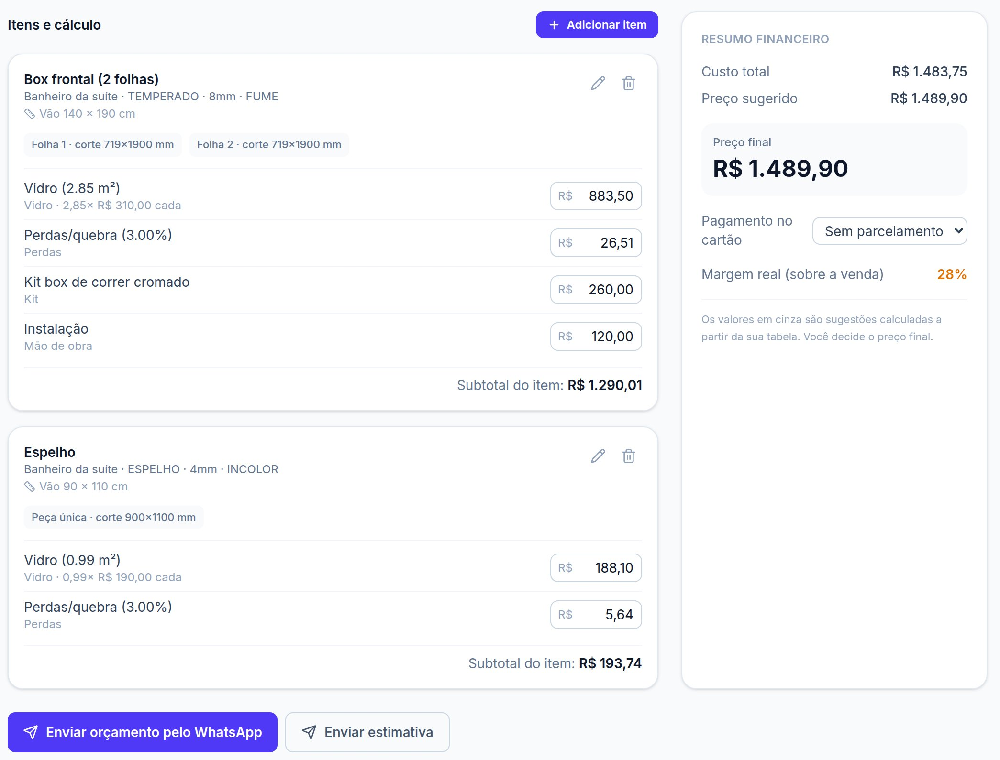
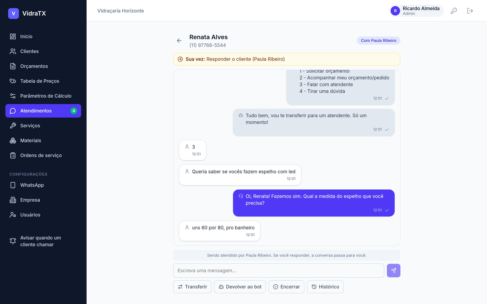
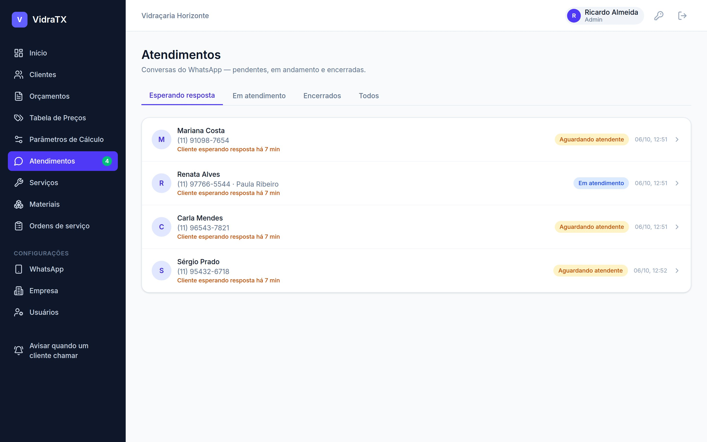
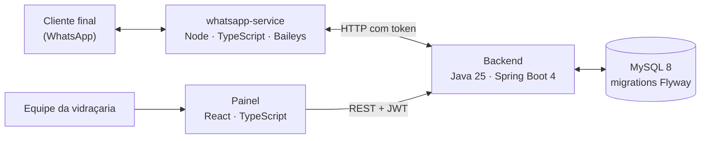

<div align="center">

# VidraTX

**SaaS de atendimento e orçamentos para vidraçarias: bot no WhatsApp, cálculo
automático do vidro e acompanhamento do pedido até a instalação.**

[](https://github.com/teixasofficial-cmd/VidraTX/actions/workflows/ci.yml)


</div>



## O problema

A vidraçaria pequena vende pelo WhatsApp. O cliente pergunta "quanto fica um
box?", o dono está na obra, a mensagem fica sem resposta e o orçamento sai na
calculadora, com o risco de errar a medida ou a margem. O VidraTX cuida desse
caminho inteiro, do primeiro "oi" até a instalação conferida.

## O que o sistema faz

- **Atendimento automático no WhatsApp.** O bot responde na hora, cadastra o
  cliente, coleta o pedido (tipo de serviço, detalhes e fotos) e passa a
  conversa para uma pessoa quando não entende ou quando o cliente pede.
- **Orçamento com cálculo automático.** São 13 tipologias prontas (box, janela,
  porta, guarda-corpo, espelho...). O sistema calcula as peças de corte com
  folgas, transpasse, área mínima e perdas, e aplica margem e arredondamento.
  Também avisa sobre vidro de segurança e margem abaixo do mínimo.
- **Aprovação pelo WhatsApp.** O cliente recebe o orçamento e responde "1"
  para aprovar. A ordem de serviço abre sozinha.
- **Agenda negociada pelo WhatsApp.** A empresa propõe data de medição e de
  instalação; o cliente confirma ou sugere outra. O sistema evita conflito de
  horário entre equipes.
- **Gestão do pedido.** Funil de orçamentos em kanban, produção, instalação
  com checklist e pós-venda.
- **Várias empresas na mesma instalação.** Cada vidraçaria entra com o próprio
  login e só enxerga os próprios dados. Perfis de administrador, gerente e
  funcionário.

## Telas

| Orçamento com cálculo por item | Conversa do WhatsApp no painel |
|---|---|
|  |  |

| Fila de atendimentos do WhatsApp | No celular |
|---|---|
|  |  |

As capturas são do sistema rodando este código, com uma vidraçaria e clientes
fictícios, e as conversas passaram pelo WhatsApp simulado dos testes de ponta a
ponta. As demais telas estão no [manual do usuário](docs/manual/manual-vidratx.html).

## Arquitetura



| Serviço | Pasta | Stack | Papel |
|---|---|---|---|
| Backend | [`src/`](src/main/java/br/com/vidratx) | Java 25, Spring Boot 4, Spring Security, JPA, Flyway, MySQL 8 | API REST, regras de negócio, fluxo do bot e rotinas agendadas |
| whatsapp-service | [`whatsapp-service/`](whatsapp-service) | Node, TypeScript, Express, Baileys | Mantém a conexão com o WhatsApp e transporta as mensagens. Não tem regra de negócio, para que o provedor possa ser trocado sem mexer no backend |
| Painel | [`dashboard/`](dashboard) | React 18, TypeScript, Vite, Tailwind CSS 4, TanStack Query | Interface da equipe, responsiva para uso na obra |
| Deploy | [`deploy/`](deploy) | Docker Compose, Caddy | HTTPS automático, backup diário e scripts de operação |

## Destaques técnicos

- **Isolamento entre empresas.** A empresa vem do token JWT do usuário
  logado, e o acesso aos dados sempre parte de consultas filtradas por ela
  (`findByIdAndEmpresaId`). Um usuário não consegue ler nem alterar dados de
  outra vidraçaria.
- **Segurança.** JWT com três perfis e 36 regras `@PreAuthorize` nos
  controllers. O super admin tem autenticação separada. As senhas usam bcrypt,
  e 5 senhas erradas seguidas bloqueiam o login por 15 minutos.
- **Motor de cálculo isolado.** As regras de corte e preço ficam em
  [`calculo/`](src/main/java/br/com/vidratx/calculo)
  (`MotorCalculoOrcamento`), separadas da camada web e testadas em unidade.
- **Bot que entende texto livre.** Respostas como "pode ser", "beleza" e 👍
  viram confirmação, e datas como "quarta às 10h" viram horário
  ([`conversa/`](src/main/java/br/com/vidratx/conversa)).
- **Entrega confiável no WhatsApp.** Cada envio leva uma chave de
  idempotência, então a mesma mensagem nunca sai duas vezes, nem depois de um
  reinício. Se o backend estiver fora, as mensagens recebidas esperam numa
  fila em disco e são reenviadas.
- **Concorrência.** Locks pessimistas (`SELECT ... FOR UPDATE`) fazem as
  mensagens de um mesmo cliente serem processadas uma de cada vez, mesmo com
  várias instâncias do backend.
- **Números do backend.** 147 endpoints REST com documentação OpenAPI
  (Swagger), 48 migrations Flyway e 10 rotinas agendadas: lembrete de
  orçamento sem resposta, expiração de propostas, reenvio de mensagens e
  alerta de WhatsApp desconectado.

## Qualidade

| Camada | Ferramentas | Testes |
|---|---|---|
| Backend | JUnit 5, Spring Boot Test, MySQL real no CI | 228 testes |
| whatsapp-service | `node:test` | 16 |
| Painel | Vitest, ESLint, checagem de tipos | 6 |
| Ponta a ponta | Roteiros em Python contra o backend real, com WhatsApp simulado | 266 verificações em 7 roteiros |

O [GitHub Actions](.github/workflows/ci.yml) roda a cada push: testes dos três
serviços, lint, build, imagens Docker, `shellcheck` dos scripts e validação do
`docker-compose.yml` e do `Caddyfile`. Os roteiros de ponta a ponta simulam um
dia inteiro de operação, com 14 clientes e 3 usuários agindo em paralelo
([e2e/](e2e/README.md)).

## Como rodar

Pré-requisitos: JDK 25, Maven, Docker (para o MySQL) e Node.js 20+.

```bash
./dev.sh          # sobe MySQL, backend, whatsapp-service e painel
./dev.sh stop     # derruba tudo
```

O script cria uma empresa de teste e imprime a URL e o login. No Windows sem
Docker, use `dev.ps1`. O passo a passo de cada serviço está no
[guia de desenvolvimento](docs/desenvolvimento.md).

## Documentação

| Documento | Conteúdo |
|---|---|
| [Guia de desenvolvimento](docs/desenvolvimento.md) | Rodar cada serviço, criar a primeira empresa, testar sem WhatsApp real |
| [Deploy em produção](deploy/README.md) | Servidor, HTTPS, backups, monitoramento e atualização |
| [Piloto com WhatsApp real](deploy/PILOTO_WHATSAPP.md) | Roteiro de homologação com dois celulares antes de liberar para clientes |
| [Testes de ponta a ponta](e2e/README.md) | O que cada roteiro cobre e como rodar |
| [Manual do usuário](docs/manual/manual-vidratx.html) | Todas as telas, para quem usa o sistema no dia a dia |
| [Inventário de funcionalidades](docs/manual/inventario-funcionalidades.md) | O que está pronto, incompleto ou só no backend |

## Próximos passos

- Site público de cada vidraçaria (a API pública já existe; falta o frontend).
- Módulo financeiro: parcelas e recebimentos, que hoje existem só no backend.
- PDF do orçamento e envio por e-mail.

## Autor

**Guilherme Teixeira**, desenvolvedor backend Java.
[LinkedIn](https://www.linkedin.com/in/guilhermeteixeira-9b04ba323) ·
[teixasofficial@gmail.com](mailto:teixasofficial@gmail.com)

<details>
<summary>English summary</summary>

VidraTX is a multi-tenant SaaS for glass and window shops. A WhatsApp bot
answers customers, collects their requests and hands the conversation over to
a person when needed. The staff builds quotes with an automatic glass-cutting
and pricing engine, and the customer approves by replying "1", which opens the
work order. Measurement and installation visits are scheduled over WhatsApp.

Stack: Java 25 and Spring Boot 4 (REST API, JWT, JPA, Flyway, MySQL 8), a
Node/TypeScript WhatsApp gateway with idempotent delivery, and a React +
TypeScript dashboard. Quality: 228 backend tests, 266 end-to-end checks
against the real backend, and CI on GitHub Actions. Deployed with Docker
Compose and Caddy (automatic HTTPS).

</details>

## Licença

Software proprietário. © 2026 Guilherme Teixeira. O código está visível para
leitura, mas nenhuma licença de uso, cópia, modificação ou redistribuição é
concedida. Veja [LICENSE](LICENSE).
